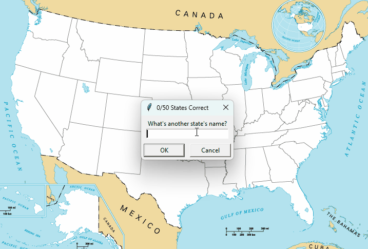

# USStatesGame

## Overview

The **US States Guessing Game** built with Python.  
Objective: Write the name of the state and see its name getting displayed in the right location on the USA map.
Try to write all the main 50 states.

## Preview



## Features

- Turtle crossing road mechanics
- Increasing difficulty as the turtle crosses the road.
- Level score tracking

## Installation & Run Instructions

To play the game locally:

1. Clone this repository:
   ```bash
   git clone https://github.com/yourusername/snake-game.git
   cd *location of the projects files*
   ```
2. Make sure you have Python 3 installed.

3. Make sure you have turtle module installed, if not, run:
   ```bash
   pip install turtle
   ```

4. Make sure you have pandas module installed, if not, run:
   ```bash
   pip install pandas
   ```

5. Run the game:
   ```bash
   python main.py
   ```
   or
   ```bash
   python3 main.py
   ```
## Requirements

- Installed Python 3
- Installed module turtle
- Installed module pandas

### Disclaimer

This project is for educational purposes only
